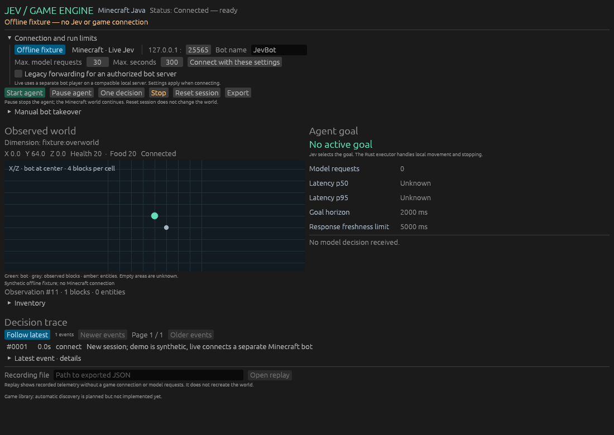
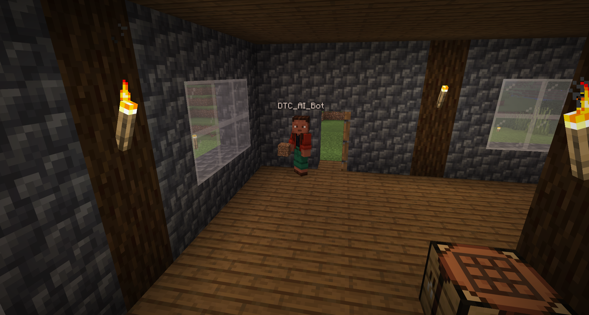

# Jev Game Engine

**See what an AI game agent observes, chooses and actually does.**

An early Rust desktop prototype for controlling games through bounded goals. [TypeSafe Jev](https://docs.typesafe.ai/) selects a goal; a local executor handles movement, validation and stopping. The aim is a reusable engine for multiple games. **Minecraft Java 26.2 is the first implemented integration.**



*The screenshot uses synthetic offline data. It is not evidence of live Minecraft or Jev control.*



*User-provided screenshot from a real Minecraft session. This is the normal game's view of the separate bot, not a 3D feed rendered by the engine and not evidence that the bot built the structure.*

## Current capabilities

- Native egui/eframe controls, observed telemetry and a local X/Z map.
- Explicit offline fixture and separate live Minecraft bot connection.
- TypeSafe goal selection, visible candidates, returned probabilities and request timing.
- Bounded navigation, pause, stop, manual takeover and world-lifecycle guards.
- Machine-checkable arrival verdict for every bounded navigation action that ends, stored in the session recording.
- Decision trace, JSON export and offline telemetry replay.

This is a prototype, not a general autonomous player. Live evidence covers a bounded executor path: an operator-driven diagnostic moved the bot about **1.118 blocks** to a verified waypoint, and one recorded live session had Jev select navigation goals whose arrival the engine measured, with **6.2887 blocks** of straight-line displacement in total (see [arrival verdicts](#arrival-verdicts) and [verification](tasks/verification.md)). Jev still preferred `wait` in 27 of that session's 30 answers (54 of the 60 decision-bearing events), so this does not demonstrate reliable autonomous navigation or arbitrary goal completion. Automated tests, fixture demos, API calls and game outcomes provide different evidence.

## Quick start

Install [Rust through rustup](https://rustup.rs/). Windows requires MSVC C++ build tools and the Windows SDK. `rust-toolchain.toml` pins `nightly-2026-09-07`; the first build downloads the toolchain and dependencies. No Node runtime is required.

```powershell
cargo run -- --fixture-preview
```

This opens the desktop app and connects the offline fixture without starting the agent. Select **One decision** or **Start agent** to exercise the synthetic controller. Fixture mode makes no TypeSafe requests and does not connect to Minecraft. Use `cargo run` to open without automatically connecting.

## Live Minecraft

The [pinned Azalea client](https://github.com/azalea-rs/azalea/tree/b65fa8cf1bb957976cefa926b9b500d44767d806) targets **Minecraft Java 26.2**. Bedrock and other protocol versions are unsupported.

Prepare an authorized compatible server and a separate test world. The adapter connects to `127.0.0.1` using a configured offline bot identity. Keep an offline-login server bound to loopback. The app does not install servers, accept their EULA, modify saves/accounts or perform Microsoft account login.

```powershell
cargo run -- --live-preview --port 25565 --bot JevBot
```

Inspect the connection and observations before starting the agent. The bot is a **separate player**. To watch it in 3D, join the same server/world using a normal Minecraft client and your own account. The engine map is sampled telemetry, not a video feed or complete world map.

For Creative-mode testing, a server operator can run `minecraft:gamemode creative JevBot` after the bot has joined its target world. Multiworld plugins may apply a world's game mode during a transfer, so verify the mode after teleportation has finished. The engine does not change game modes or server permissions automatically.

An independently managed SSH tunnel can expose an authorized remote backend on loopback. Use `--legacy-forwarding` only when that backend explicitly requires it and authorizes the bot. The forwarded UUID derives from the configured bot name; arbitrary identity override is not supported. Close previous previews before reconnecting the same identity.

### Session objective, pacing and safety reflex

Three session settings exist for a longer unattended run. All are empty or off by default, so a session without them builds exactly the requests and recordings earlier sessions did.

- `--objective "<text>"` (UI: *Session objective*, up to 400 characters) states the operator's goal for the session. It travels to the model as its own `objective` field beside `observation` in the request state and is named in the question's instructions. The engine never derives an action from it: only the model's choice among the legal candidates binds a goal, so an objective cannot make the bot do anything the candidate list does not offer.
- `--request-interval-seconds N` (UI: *Pacing (s)*) is the minimum gap between model requests in continuous mode, so a long session is bounded by wall clock as well as by request count. `0` keeps the unpaced behaviour.
- `--safety-reflex` (UI: *Engine safety reflex*) opts in to the one path where the engine dispatches an action without a model request. When a hostile mob is within 6 blocks and no navigation goal is in flight, the engine stops local work, records a `reflex` event naming the threat and the goal it superseded, and dispatches one bounded flight goal: the observed waypoint that puts the most distance between bot and threat, at least 1.5 blocks more than now. The action is labelled `SAFETY-REFLEX` in the timeline and the offline report. The reflex never preempts a navigation goal, so no arrival verdict is lost; it waits at least 1.5 s between two reflexes; and it does nothing when no observed cell improves the distance.

Independently of the reflex, whenever a hostile mob is within 12 blocks the request's candidate list gains up to three `flee_*` goals ranked by the distance they put between bot and threat, so the model can choose to withdraw. Hostile kinds are matched against a fixed list of protocol entity names; neutral mobs, players and projectiles are not threats. `--max-requests` and `--max-seconds` accept up to 100 000 requests and 7 days, so a night can be budgeted explicitly.

**Night run.** `session-run` is the headless counterpart to *Start agent*: it runs one budgeted continuous session with these settings, exports the recording and prints a JSON summary read from it. Every flag:

```powershell
$env:TYPESAFE_API_KEY_FILE = 'C:\private-config\typesafe-key'
cargo run --bin session-run -- --port <TUNNEL_PORT> --bot <BOT_NAME> --legacy-forwarding `
  --objective "Survive the night and keep health" --safety-reflex `
  --request-interval-seconds 20 --max-requests 60 --max-seconds 1500 `
  --connect-seconds 60 --export runs/night.json
```

`--fixture` (optionally with `--fixture-reachable-waypoint`) runs the identical loop against the offline fixture with no key and no server; `--keep-connected` leaves the bot in the world afterwards; `--quiet` prints only the summary. Exit 0 means the engine ended the session on its own budget with the bot still connected; 1 is a connection failure, 2 invalid arguments or a missing key, 6 a provider failure, 7 a disconnect during the session and 8 a session that neither ended nor failed inside the wall-clock guard. The summary counts requests, answers by kind (`wait`, `waypoint`, `flee`), engine safety-reflex actions, arrival verdicts, straight-line displacement, final health and whether the bot was connected at the end, all derived from the exported recording's events, so `recording-report` on that file agrees with it.

None of this has live evidence yet. The objective, the pacing gate, the flight candidates, the reflex and the night-run harness are covered by offline tests only, until a live recording exists; see [verification](tasks/verification.md#session-objective-and-safety-reflex-added-2026-09-26-offline-evidence-only).

### TypeSafe key

Configure a key outside the repository before launching:

```powershell
$env:TYPESAFE_API_KEY_FILE = 'C:\private-config\typesafe-key'
cargo run -- --live-preview --port 25565 --bot JevBot
```

The file contains the API key. `TYPESAFE_API_KEY` is also supported and takes precedence. Do not commit keys or include them in shared artifacts. Live agent requests count toward configured request/time budgets. Missing keys, rejected responses and failed connections produce visible errors, without hidden fixture fallback. See the [TypeSafe HTTP API](https://docs.typesafe.ai/api).

## Controls

| Control | Behavior |
|---|---|
| Connect | Applies settings and starts a new session. |
| Start agent | Repeatedly requests bounded goals within budgets. |
| One decision | Requests one goal, not one Minecraft tick. |
| Pause agent | Cancels pending work and stops movement; the world continues. |
| Stop | Stops local work and disconnects. |
| Reset session | Clears session state, not the Minecraft world. |
| Manual takeover | Revalidates a candidate and records manual control. |
| Export / Open replay | Saves or inspects telemetry without re-executing actions. |

The trace distinguishes **dispatched**, **accepted** and **rejected** actions. Acceptance does not prove arrival; local arrival is decided and recorded by the engine ([Arrival verdicts](#arrival-verdicts)). Actions carry an observed world epoch, including same-dimension respawns, to invalidate obsolete work.

## Latency and recordings

Jev chooses goals over seconds; Rust handles local movement and stopping. Goal duration is 4 × rolling request-latency p95, bounded to 2–10 seconds. Response freshness is 2 × p95, bounded to 1.5–5 seconds. Warmup uses a two-second goal and five-second response limit. These are request measurements, not network ping or a benchmark of task success. Adaptation benefits still need controlled evaluation.

Export writes versioned JSON under `runs/` relative to the working directory. Replay makes no model requests or game connections. It does not restore worlds, guarantee deterministic simulation or reveal alternative action outcomes. Inspect recordings for private names and telemetry before sharing.

### Arrival verdicts

Every bounded navigation action that ends records a machine-checkable `ArrivalVerdict` on its `executor` event in the session recording. The verdict holds the bound `target`, the `measured_distance_m` between the observed bot position and that target, the `tolerance_m` in effect, the allowed `duration_ms`, the observed `elapsed_ms`, and `arrived`. `arrived` is true when the observed distance fell below the tolerance, and false when the bounded goal duration expired first. `measured_distance_m` is absent when no connected observation was available to measure.

A single engine-side constant, `ARRIVAL_TOLERANCE_M = 0.6` (`src/model.rs`), is the one source of truth for both excluding waypoint candidates closer than the tolerance and deciding local arrival. Navigate candidates are built only from the observation snapshot the model is shown, and their description includes the measured distance to the observed waypoint. The model never supplies coordinates or durations, and arrival is decided by the engine rather than by a further model request.

When a bounded action ends, the engine issues the local Stop itself and records one of:

- `Local executor: target reached` (the observed distance is below the tolerance).
- `Local executor: goal duration expired without arrival` (a navigation goal expired without reaching its target).
- `Local executor: goal duration expired` (for target-less goals such as waiting).

The offline fixture makes its geometry explicit instead of leaving it implicit. `fixture::DISTANT_WAYPOINT` (5.657 blocks from the origin) is what `fixture::spawn()` uses, and therefore what the desktop app's offline demo uses by default. The fixture closes 0.1 blocks per 50 ms tick, so 2 blocks per second, and a 2000 ms demo goal can travel at most 4.0 blocks: the default demo therefore records an honest expiry rather than an arrival tuned to look good. `fixture::spawn_with_waypoint(..)` with `fixture::REACHABLE_WAYPOINT` (1.5 blocks out, about 0.45 s of travel) is the geometry in which one bounded goal records `arrived`. The geometry is part of the session settings (`Settings::fixture_waypoint`, default `Distant`), so an operator selects it with the `Reachable fixture waypoint` checkbox or `--fixture-reachable-waypoint`, a test selects it the same way, and a recording carries the setting that was in force. Both remain synthetic telemetry, so an arrived fixture verdict exercises the engine's measuring, verdict and local Stop path, not Minecraft pathfinding.

Stopping never depends on another model request. Event JSON keeps `"arrival"` optional, so recordings written before the verdict existed still load. Recordings remain `schema_version` 1, and replay stays offline: no provider calls, no Minecraft calls, immutable.

**Live evidence.** One recorded live session on an operator-authorized loopback test server shows Jev selecting navigation instead of waiting: 3 of the 30 model answers chose a waypoint candidate — each answer is recorded twice, on its `decision` event and on the `dispatched` event carrying the same decision, so the recording holds 60 decision-bearing events for 30 answers — the adapter accepted all 3 navigation actions, and the engine recorded 3 verdicts with `arrived` true — measured 0.1451 m, 0.0281 m and 0.0945 m against the 0.6 m tolerance, with `elapsed_ms` 613–723 ms inside a 3460 ms bound. The same session moved the bot 6.2887 blocks straight-line, recorded no manual takeover and observed health unchanged. Two limits belong with that number rather than beside it: 27 of the 30 answers were `wait` (54 of the 60 decision-bearing events), and the app gives the operator no way to express a goal, so Jev's own preference decides what is attempted. An earlier live session stopped safely instead of acting when the returned distribution failed the probabilities-sum-to-one check. The raw recording is retained by the operator outside this repository; the counts and distances above were read from it and cross-checked against server-side position reads taken while it ran. The same recording was then re-read without the GUI, through the app's own recording loader: `cargo run --bin recording-report -- <path>` validated it and printed the three arrived verdicts with their measured distances, tolerances and deadlines, and it reported no navigation goal that expired with a bound target — every navigation action that ran arrived. [tasks/verification.md](tasks/verification.md) reports the same session in full.

### Who chose the action

`origin::event_origin` labels a recorded event from fields it already carries, so a recording stays readable without trusting a screenshot: `MANUAL` for an operator takeover (its recorded message says so), `SAFETY-REFLEX` for a flight goal the engine's opt-in reflex dispatched without a model request (the `reflex` event and the action's recorded messages say so), `FIXTURE` for the offline fixture's synthetic decision (`model == "offline-fixture"`), and `JEV-SELECTED` for a goal the configured model chose. Events that carry none of these — connections, observations, budgets and requests, and any `action` or `executor` row whose decision was recorded on the dispatch — get no label. The desktop timeline and `recording-report --chain` call the same helper, so the offline report shows the same separation as the GUI without a connection or a provider call.

## Development

```powershell
cargo fmt --check
cargo test
cargo check
cargo clippy --all-targets -- -D warnings
```

On Windows, `.\scripts\start-preview.ps1` accepts app arguments and launches a separate executable copy so an open preview does not lock Cargo's build output.

Capture the rendered app without closing it:

```powershell
cargo run -- --fixture-preview --screenshot runs/ui.png
```

Do not combine this with `EFRAME_SCREENSHOT_TO`. Live capture waits for an observation, error or timeout; inspect the image before treating it as evidence.

Capture the arrival verdict instead of the first frame:

```powershell
cargo run -- --fixture-preview --screenshot-after-goal docs/images/arrival-verdict.png
```

This gate waits for an event that carries an `ArrivalVerdict` (up to 30 s), selects that event, opens its detail panel and grows the window so the measured numbers are inside the image: otherwise the verdict panel sits below the window edge and the capture would show a collapsed header instead. In offline fixture mode the gate issues one decision itself, which the fixture answers without a provider call; in live mode it never starts the agent and only waits for the verdict from whatever the operator runs. Use either flag, not both. `docs/images/arrival-verdict.png` was produced with `cargo run -- --fixture-preview --fixture-reachable-waypoint --screenshot-after-goal docs/images/arrival-verdict.png` and shows the arrived verdict with its measured numbers: the executor row reads `Local executor: target reached` and its detail panel reads `Arrival: arrived · measured 0.50 m / tolerance 0.60 m · target (1.50, 64.00, 0.00) · elapsed 499 ms / duration 2000 ms`, with the fixture's dispatched and decision rows labelled `FIXTURE`. Dropping `--fixture-reachable-waypoint` captures the expiry path instead, because the default fixture waypoint lies out of reach: `Arrival: expired · measured 1.76 m / tolerance 0.60 m · target (4.00, 64.00, 4.00) · elapsed 2000 ms / duration 2000 ms`. Both are synthetic fixture telemetry and neither shows Minecraft pathfinding.

`cargo run --bin connection-probe -- --port 25565 --bot JevBot` observes and disconnects. Optional `--jev` makes one real request; `--jev --move` offers a bounded navigation target; `--local-move` tests the executor without Jev. `--action-ms` sets 250–3000 ms (default 500), and `--settle-seconds` allows time to leave a lobby. `cargo run --bin provider-probe` sends a synthetic disconnected-state API probe, not a Minecraft run.

`cargo run --bin navigation-demo -- --port <TUNNEL_PORT> --bot <BOT_NAME> --legacy-forwarding` is the operator harness for **one model-selected** bounded navigation goal on a loopback server. It drives the real engine: one observation snapshot, one decision over the bounded candidates, one dispatched action, the engine's own arrival verdict and the local Stop. It prints the correlated chain as JSON and exports a recording, with exit codes 0 for a target reached inside the tolerance, 3 for a bounded goal that expired without arrival, 4 when no verdict was recorded and 1 for a connection, provider or budget failure. It never selects a goal itself, never edits blocks, uses no manual takeover and sends a single request, so it is not the manual diagnostic above and does not claim the model chose a sensible target.

`cargo run --bin session-run -- --fixture --objective "Survive the night" --safety-reflex --max-requests 3 --max-seconds 60 --export runs/fixture-night.json` runs the headless multi-goal session ([night run](#session-objective-pacing-and-safety-reflex)) against the offline fixture: no key, no server, an exported recording that loads through the app's own loader, and a summary derived from it. The same command without `--fixture` and with `--port`, `--bot` and `--legacy-forwarding` is the live night run. `tests/session_harness.rs` runs the fixture form and checks the summary against the recording.

`cargo run --bin recording-sanitize -- <input.json> <output.json> --redact from=to [--redact from=to …]` prepares a recording for publication. It validates the input through the same loader the app uses, replaces each named identifier in every string value, validates the result again and only then moves it into place: a result the engine no longer accepts is not written at all, and running without `--redact` is refused outright, because the tool replaces exactly what you name and does not detect identifiers for you. Numbers are never rewritten, so distances, tolerances and elapsed times stay the recorded ones. The live session quoted above was sanitized this way — 154 events, 30 requests, 30 model answers recorded on 60 decision-bearing events and the same three arrived verdicts at 0.1451 m, 0.0281 m and 0.0945 m with the bot name and world name replaced — and that copy stays in the operator's evidence set until they decide to publish it.

`cargo run --bin recording-report -- runs/session-….json [--chain] [--require-arrival] [--json]` reads one exported recording through the same `recording::load` validation the app uses and reports event, request, answer, decision-bearing-event, choice and arrival-verdict counts plus each arrived verdict's measured distance, tolerance and deadline. `--chain` adds the request, decision, dispatch and accepted action that led to each arrival, correlated by order rather than by message text, so the whole bounded goal can be read from the recording. It opens no connection, makes no provider call and never writes to the recording, so an exported chain can be checked without the GUI; `--require-arrival` exits 3 when the recording contains no arrived verdict, and `--json` prints the same summary for a script.

See [architecture](docs/architecture.md) and [contributing](CONTRIBUTING.md).

## Limits and direction

Automatic combat, mining, building, inventory manipulation and general task planning are not implemented. Threat awareness is limited to withdrawing from a listed hostile mob toward an observed waypoint; it has not been exercised against a live mob, and a stated session objective is information for the model, not a plan the engine executes. Endpoint/pathfinding guards do not guarantee harmless routes or server permission to run bots. Use an authorized test environment.

Farming Simulator 25 is the next proposed adapter, pending a separate mod-bridge investigation. Library scanning and additional Jev roles remain proposals: [scanner assessment](tasks/optiscaler-research.md), [Jev opportunities](tasks/jev-opportunities.md). Installation discovery does not prove ownership, subscription entitlement or AI support.

## Credits and license

Built with TypeSafe/Jev, Azalea, egui/eframe and other open-source dependencies, informed by community game-agent projects. See [CREDITS.md](CREDITS.md) and [LICENSE](LICENSE). Third-party projects, game assets and services retain their own terms. This project is not affiliated with Mojang or Microsoft.
